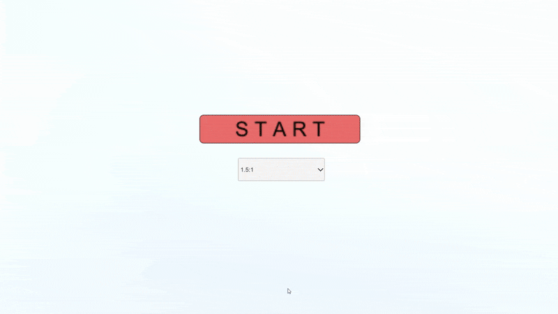

# FPS_Aim_Training

Unity製FPSの研究用ゲームです。マウスエイムの精度とスピードを測定・トレーニングすることを目的としています。

## ゲーム概要

- マウスでターゲットを狙い、クリックで撃つ
- 命中ごとにスコア記録
- 一定数のターゲットを破壊すると次セットへ
- 各セットでターゲットの位置がランダムに生成される
- ヒット精度や反応時間などをCSVとして保存可能

## 使用技術

- Unity 2021.3.4f1
- C#
- CSV出力機能
- Git

## プレイデモ（GIF）

